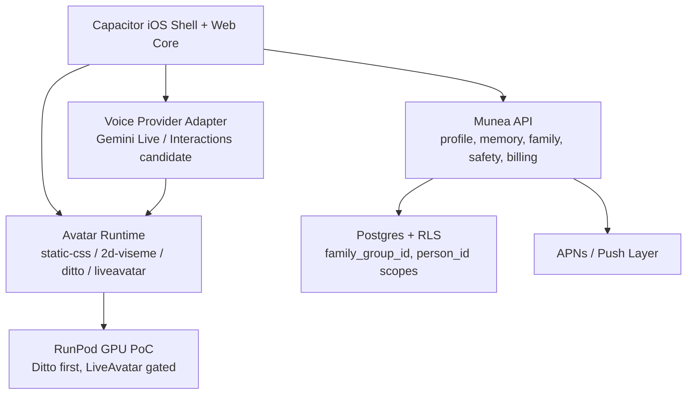

# Munea Tech Stack Evaluation

> Updated: 2026-06-29
> Purpose: evaluate whether the current product technology plan is the best path for first TestFlight and later Avatar / health-care expansion.

## Executive Verdict

The current direction is mostly right, with three corrections:

1. Keep **Capacitor + Web Core** for the first iOS path.
2. Replace model-specific wording such as "Gemini 3.1 Flash Live" with a **Voice Provider Adapter**. Gemini Live / Interactions should be the first candidate, not a hard dependency.
3. Move the data layer from local JSON to **Postgres + row-level tenant isolation** before multi-user testing.

Best current path:



## Stack Scorecard

| Area | Current Plan | Verdict | Recommendation |
|---|---|---|---|
| App shell | Capacitor iOS first | Keep | Best speed-to-TestFlight path, but requires Mac/Xcode verification |
| Frontend | Static web core | Keep short term | Keep until product flow stabilizes; do not over-migrate before TestFlight |
| Voice | Gemini direction | Keep, but abstract | Use provider adapter; do not hard-code one model/version |
| Avatar | Runtime + 2D fallback + Ditto/LiveAvatar PoC | Keep | This is now the right strategy: Avatar-first, not GPU-first |
| Data | local JSON | Replace soon | Move to Postgres + RLS before family/multi-user testing |
| Push | not built | Add early | Push is part of the product loop, not an afterthought |
| Payments | not built | Use RevenueCat or StoreKit2-backed server ledger | Faster launch with RevenueCat, ledger still lives on our backend |
| Health data | Apple Health future bridge | Keep gated | Request only core permissions; avoid medical claims |
| GPU infra | RunPod PoC | Keep as PoC only | Ditto first; LiveAvatar benchmark only after H100/H200 plan is clear |

## App Shell

Recommendation: keep Capacitor.

Why:

- Capacitor gives the current web prototype a direct iOS shell path.
- Official Capacitor iOS docs state that Capacitor uses WKWebView and is managed through Xcode/CocoaPods.
- Capacitor v8 currently expects modern iOS/Xcode support. This means the Mac/Xcode environment must be checked before assuming build readiness.

Risk:

- WKWebView microphone behavior must be tested on a real iPhone.
- If WebView audio capture is unstable, add a small native audio bridge rather than abandoning Capacitor.

## Voice / AI

Recommendation: use a provider adapter, with Gemini Live / Interactions as the first candidate.

Why:

- Google's Live API is designed for low-latency real-time audio/video/text interactions and supports WebSocket streaming.
- Google documents production security concerns around direct frontend connections and recommends ephemeral tokens instead of standard API keys.
- The same official material is evolving quickly: Live API may be preview in one surface while newer Gemini interaction surfaces are GA. This is exactly why the product should not hard-code a model name or vendor-specific path into the app core.

Implementation direction:

```text
MuneaVoiceProvider
  connect(sessionContext)
  sendAudioChunk(pcm16)
  onTranscript(callback)
  onAudioChunk(callback)
  interrupt()
  close()
```

First candidate:

- Gemini Live / Interactions path.

Fallback:

- STT -> `/chat` -> TTS.
- Typed chat if microphone fails.

## Avatar

Recommendation: current route is now right.

Keep:

- `MuneaAvatarRuntime`.
- `static-css` fallback.
- `2d-viseme` as first TestFlight-capable live presence.
- `ditto` and `liveavatar` as reserved adapter targets.

Why:

- Avatar is core to the product feeling.
- Full GPU avatar is still an infrastructure and cost risk.
- Runtime-first lets Munea feel alive before the GPU path is proven.

GPU path:

- Ditto online retest first.
- LiveAvatar first benchmark second.
- Do not wire GPU engines directly into `聊聊`; attach them behind Avatar Runtime.

## Backend And Data

Recommendation: choose Postgres + RLS as the first production data layer.

Why:

- Munea's real data model is relational: family groups, people, profiles, permissions, transcripts, health snapshots, safety events, subscriptions, and usage ledger.
- Supabase's RLS approach is a strong fit because RLS can enforce data access at the row level and combine with auth for end-to-end user security.

Minimum schema scopes:

- `family_group_id`
- `person_id`
- `companion_id`
- `actor_user_id`

Do not proceed to family beta with local JSON.

## Push And Proactive Care

Recommendation: implement push early.

Why:

- The product promise is not only in-app chat. It includes reminders, family nudges, and proactive care.
- Capacitor has a Push Notifications plugin with iOS permission flow and registration token callbacks.
- Whether the backend sends via APNs directly or through FCM can be decided after iOS shell setup; the product requirement is a reliable push layer.

First push events:

- daily check-in.
- medication / routine reminder.
- family reply / encouragement.
- safety escalation.

## Payments

Recommendation: use RevenueCat for first subscription infrastructure, but keep authoritative usage ledger in Munea backend.

Why:

- RevenueCat reduces StoreKit launch complexity.
- Apple and RevenueCat both support server notification flows for subscription state changes.
- Munea still needs its own ledger for Avatar/GPU usage, monthly grants, purchased points, and safety audits.

Do not let the frontend own balances.

## Health / Compliance

Recommendation: Apple Health integration remains gated and privacy-first.

Why:

- Apple HealthKit requires explicit permission and user control.
- Apple's health guidance emphasizes privacy, minimal data collection, clear purpose strings, and avoiding advertising/data-mining uses for health data.
- Munea should remain companion/reminder/referral, not diagnosis/treatment/prescription/therapy.

First HealthKit scope:

- steps.
- sleep summary.
- heart rate summary.
- medication/routine context only if review risk is acceptable.

## Best-Path Roadmap

### Now

- Keep Capacitor.
- Keep Avatar Runtime.
- Add Voice Provider Adapter.
- Choose Postgres + RLS.
- Keep RunPod GPU work as measured PoC, not product dependency.

### Before TestFlight

- iOS shell on real iPhone.
- microphone permission/capture verified.
- 2D viseme fallback visually acceptable.
- push registration proof.
- privacy copy and medical boundary copy ready.

### Before Family Beta

- Supabase/Postgres schema.
- RLS policies.
- family group permissions.
- transcript retention/delete/export policy.
- RevenueCat or StoreKit2 subscription proof.

### Later

- Ditto integration if RunPod online fps passes.
- LiveAvatar only as premium/high-end or pre-generated moments unless benchmark economics improve.

## Source Notes

- Capacitor iOS docs: https://capacitorjs.com/docs/ios
- Capacitor plugins docs: https://capacitorjs.com/docs/plugins
- Capacitor push notifications: https://capacitorjs.com/docs/apis/push-notifications
- Capacitor config secure context note: https://capacitorjs.com/docs/config
- Gemini Live API docs: https://ai.google.dev/gemini-api/docs/live-api
- Google Interactions API GA announcement: https://blog.google/innovation-and-ai/technology/developers-tools/interactions-api-general-availability/
- Apple Health and fitness app guidance: https://developer.apple.com/health-fitness/
- Apple App Store Review Guidelines: https://developer.apple.com/app-store/review/guidelines/
- Supabase Row Level Security docs: https://supabase.com/docs/guides/database/postgres/row-level-security
- Apple App Store Server Notifications V2: https://developer.apple.com/documentation/appstoreservernotifications/app-store-server-notifications-v2
- RevenueCat Apple server notifications: https://www.revenuecat.com/docs/platform-resources/server-notifications/apple-server-notifications
- RunPod Serverless GPU inference: https://www.runpod.io/product/serverless
